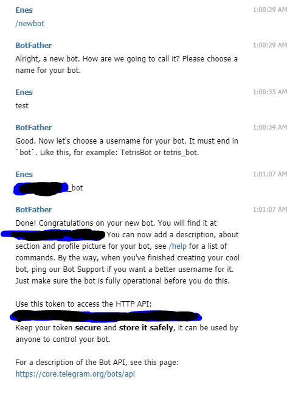

# keylogger-with-telegram-bot
<h3>Step by step creating telegram-bot </h3>

1- Search botfather on telegram  
2- Write /start --> /newbot more in the picture  
3- Note the token  
 

4- Now we need to get the chat_id number. Search @chatid_echo_bot on telegram and write /start  
5- Note down the chat id and it's done.

 
